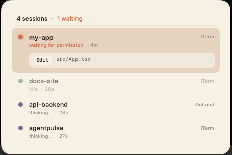
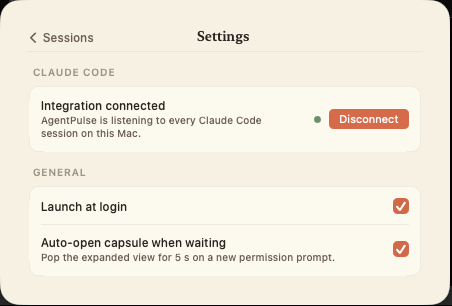

# AgentPulse

A menu-bar companion for Claude Code. See every session at a glance, get pinged the moment one needs you, and jump straight to the right terminal or IDE window.



## Install

### Option A — Download (recommended)

1. Grab the latest **AgentPulse.dmg** from the [Releases page](https://github.com/fanook/agentpulse/releases/latest).
2. Double-click the DMG, drag **AgentPulse** into **Applications**.
3. **First launch**: the build isn't code-signed, so macOS will refuse a plain double-click. In Finder, **right-click** `/Applications/AgentPulse` → **Open** → confirm. macOS remembers the choice after that.

### Option B — Build from source

```bash
curl -fsSL https://raw.githubusercontent.com/fanook/agentpulse/main/install.sh | bash
```

Builds locally from source, installs into `/Applications`, wires the Claude hooks, launches the app. No additional steps needed.

## Getting started

1. **Left-click** the **AP** icon in the menu bar — the capsule slides down.
2. **Right-click** the **AP** icon → **Settings…** to open the preferences screen inside the capsule.
3. Under **Claude Code**, click **Connect** — this wires AgentPulse into `~/.claude/settings.json` so every session you run with `claude` shows up automatically. (Option B did this for you; Option A users need to click it once.)
4. That's it. Run `claude` anywhere. Click **AP** anytime to see what's going on; click any row to jump back to the source terminal.

Press **Esc** or click outside the capsule to dismiss it.

## Settings



Right-click **AP** → **Settings…**.

- **Claude Code › Connect / Disconnect** — wires (or unwires) the hook bridge in `~/.claude/settings.json`. The status dot tells you if the integration is active.
- **Launch at login** — start AgentPulse automatically when you log in.
- **Auto-open capsule when waiting** — when Claude hits a permission prompt, the capsule pops down for five seconds. Turn this off if it's distracting; the menu-bar badge still shows the count.

## Uninstall

Open **Settings…** → **Claude Code** → **Disconnect**, then drag `/Applications/AgentPulse.app` to the Trash.

Installed via the script? A full cleanup (including caches and hook entries) is one command:

```bash
~/.agentpulse-src/uninstall.sh
```

## Privacy

- Nothing leaves your Mac. The HTTP server listens on `127.0.0.1` only; there's no telemetry.
- Local state lives in `~/Library/Application Support/AgentPulse/sessions.json`, `~/Library/Logs/AgentPulse/hooks.log`, and `~/.pulse/`.

## For developers

Architecture, HTTP protocol, and how to add a new agent adapter — see [docs/developing.md](docs/developing.md).

## License

MIT — see [LICENSE](./LICENSE).
